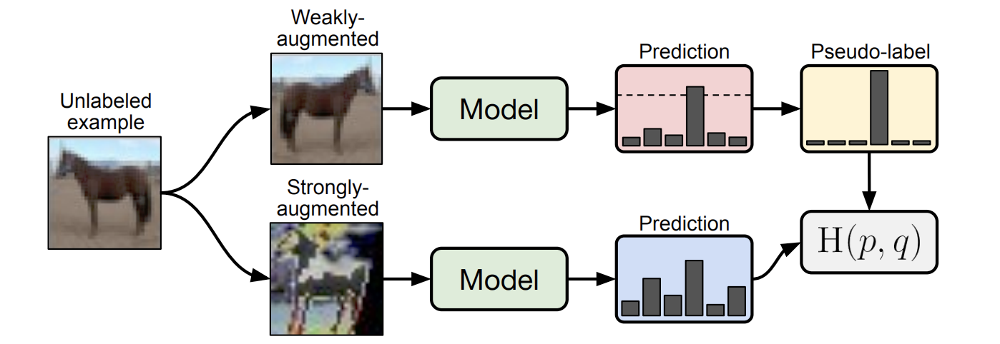

# Dataset


## Requirment
``` shell
pip install -r requirements.txt
```

## Dataset


## Result
| Backbone                 | FixMatch                 |
|--------------------------|--------------------------|
|  |  |

## Reference

- valencebond [FixMatch_pytorch](https://github.com/valencebond/FixMatch_pytorch)  
- kekmodel [FixMatch-pytorch](https://github.com/kekmodel/FixMatch-pytorch)  
- google-research [fixmatch](https://github.com/google-research/fixmatch)  

## Citations
```
@article{sohn2020fixmatch,
  title = {FixMatch: Simplifying Semi-Supervised Learning with Consistency and Confidence},
  author = {Kihyuk Sohn, David Berthelot, Chun-Liang Li, Zizhao Zhang, Nicholas Carlini, Ekin D. Cubuk, Alex Kurakin, Han Zhang, Colin Raffel},
  journal = {arXiv preprint arXiv:2001.07685},
  year = {2020},
}
```